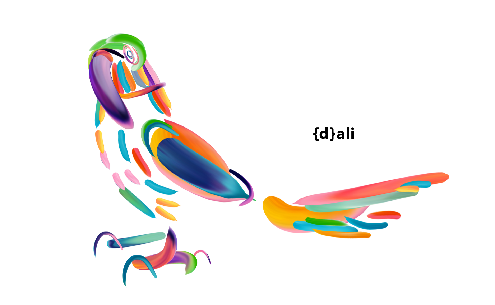

# {d}ali

### Understanding and applying Gestalt Laws of Perceptual Organization



### Vision for Release 1.0

The objective for this release is to address the fundamental principle of Gestalt Laws of Perception - the law of Prägnanz - focusing on understanding and applying the Laws of **Proximity**, **Similarity** and **Good Gestalt**.

The law of proximity states that when an individual perceives an assortment of objects they perceive objects that are close to each other as forming a **group**. For now, we'll only be addressing the composition of this group perception on a **vertical stack**. 

The law of similarity states that elements within an assortment of objects are perceptually grouped together if they are **similar to each other**. For now we'll only be addressing when perception occurs in the form of **shape**.

The law of good gestalt explains that elements of objects tend to be perceptually grouped together if they form a pattern that is regular, simple, and orderly. For now we'll only be adressing this perception on a **horizozntal stack** of the **vertical stack** composition.

> The birth of {d}ali will be grounded on the undertsanding of the purest expression of primitive visual artifacts: circles, triangles and squares. 

### Coding Principles

#### Module One

The objective of this module is to **analyse**, **recognize**, and **group** similar simple geometric shapes.

The Analysis, ideally, would benefit from having a dataset of simple geometric shapes, for the analysis to be streamlined. This analysis will only have a structured output if the input itself is structured as well, therefore people will be able to input as many and diverse simple geometric shapes as they want. The Recognition, ideally, would benefit from the dataset analysis output, and would help to start creating some meta-information about each object. Hard data, easy solutions. The grouping, ideally, would be a comprehensive data composition, strong enough to feed Module Two. This is not aesthetics.

> For now, this module it's based on the name of the file, which is pretty much immature. I welcome the work there is to be done, time and time again.

#### Module Two

The objective of this module is to **eliminate complexity and unfamiliarity** so we can obtain an output in its most simplistic form. Eliminating extraneous stimuli helps our minds creating meaning. This meaning created by perception implies a global regularity, which is often mentally prioritized over spatial relations. The visual translation of every group of shapes composition implies the ideas of salience, conciseness and orderliness.

> For now, this module it's based on the vertical stack of similar shape groups, which is pretty much immature. I welcome the work there is to be done, time and time again. 

#### Module Three

The objective of this module is an attempt to understand the laws behind the ability to **acquire and maintain meaningful perceptions** in an apparently chaotic world. Based on the input from Module One and Module Three, this third module should decrease the effort of the perception of simplicity in the midst of the compositions of several and diverse objects and increase the ability to recognize order.  

> For now, this module it's based on the horizontal stack of the vertical stack of similar shape groups, which is pretty much immature. I welcome the work there is to be done, time and time again. 

### Instalation

> This is a pretty straightforward setup, and I'll do my best to keep it as simple as possible on the following releases.

The recommended way to install **{d}ali** is:

1) Install Homebrew

```
$ ruby -e "$(curl -fsSL https://raw.githubusercontent.com/Homebrew/install/master/install)"
```

Once you’ve installed Homebrew, insert the Homebrew directory at the top of your PATH environment variable. You can do this by adding the following line at the bottom of your ~/.profile file

```
	export PATH=/usr/local/bin:/usr/local/sbin:$PATH
```

2) Install Python 3

```
$ brew install python3
```

3) Install PIP

To install or upgrade pip, download get-pip.py from the [oficial site](https://pip.pypa.io/en/latest/installing/). Then run the following command:

```
$ python3 get-pip.py --user 
```

The next step is to install Pipenv, so you can install dependencies and manage virtual environments. Read the [Pipenv & Virtual Environments](http://docs.python-guide.org/en/latest/dev/virtualenvs/#virtualenvironments-ref)docs. 

```
$ python3 -m pipenv
```

4) Install numpy

```
$ pip3 install numpy
```

5) Install opencv

```
$ git clone https://github.com/Itseez/opencv.git
```

```
$ cd opencv
```

```
$ git checkout 3.3.0
```

Please be aware of the lastest version, on the [oficial site](https://opencv.org/).

5) Install opencv_contrib Module

```
$ git clone https://github.com/Itseez/opencv_contrib
```

```
$ cd opencv_contrib
```

```
$ git checkout 3.3.0
```

Please be aware of the lastest version, on the [oficial site](https://github.com/opencv/opencv_contrib/releases).

### Running {d}ali

```
$ python3 main.py
```

#### Acknowledgements

Thanks to all the brilliant people at [source{d}](https://sourced.tech/) who I have the luck to work with, being always such a huge inspiration. A strong hug to my special друг [Egor](https://github.com/EgorBu).

Many statements in this file are partially taken from [Gestalt Psychology](https://en.wikipedia.org/wiki/Gestalt_psychology).
